# 🤖 **NexusAI: Universal Web-Powered Chatbot**

[](https://www.python.org/)
[](https://flask.palletsprojects.com/)
[](https://huggingface.co/)
[](https://www.selenium.dev/)
[](https://www.trychroma.com/)
[](LICENSE)

---

## 🚀 Description

**NexusAI** is a universal, web-powered chatbot built on the Retrieval-Augmented Generation (**RAG**) paradigm. It leverages the power of LLMs and real-time web scraping to answer any question with up-to-date, trusted information. It features a modern, interactive UI, a robust caching system, and smart source prioritization (Wikipedia, news, and more). Designed for general knowledge, research, and information retrieval, NexusAI delivers fast, accurate, and beautifully formatted answers.

---

## 🧠 How It Works: RAG Workflow

NexusAI is a **Retrieval-Augmented Generation (RAG)** chatbot. This means it combines real-time information retrieval from the web with the generative power of LLMs:

1. **Retrieval:** For each user query, NexusAI searches the web for the most relevant, trusted sources and scrapes their content (static and dynamic pages).
2. **Augmentation:** The retrieved content is provided to a Large Language Model (LLM), which uses it as context.
3. **Generation:** The LLM synthesizes the retrieved data into a clear, well-structured, markdown-formatted answer.

### 🖼️ Visual RAG Workflow

```mermaid
graph TD
    A[🧑‍💻 User Query] --> B{🌐 Retrieve Relevant Web Content};
    B --> C[🦾 Scrape & Extract Data];
    C --> D[🤖 LLM Synthesizes & Generates Answer];
    D --> E[💬 Formatted Bot Response];
```



---

## 📚 Table of Contents

- [🤖 **NexusAI: Universal Web-Powered Chatbot**](#-nexusai-universal-web-powered-chatbot)
  - [🚀 Description](#-description)
  - [🧠 How It Works: RAG Workflow](#-how-it-works-rag-workflow)
    - [🖼️ Visual RAG Workflow](#️-visual-rag-workflow)
  - [📚 Table of Contents](#-table-of-contents)
  - [✨ Features](#-features)
  - [🖼️ Screenshots / Demo](#️-screenshots--demo)
  - [🛠️ Tech Stack and Dependencies](#️-tech-stack-and-dependencies)
  - [⚙️ Installation and Setup Instructions](#️-installation-and-setup-instructions)
  - [🚦 Usage Instructions](#-usage-instructions)
  - [🗂️ Code Structure and Folder Hierarchy](#️-code-structure-and-folder-hierarchy)
  - [🤝 Contribution Guidelines](#-contribution-guidelines)
  - [🐞 Known Issues and Troubleshooting](#-known-issues-and-troubleshooting)
  - [📄 License](#-license)
  - [🙏 Acknowledgments and References](#-acknowledgments-and-references)
  - [📬 Contact Information](#-contact-information)
- [-NexusAI-Universal-Web-Powered-Chatbot](#-nexusai-universal-web-powered-chatbot-1)

---

## ✨ Features

- 🔎 **Real-Time Web Scraping**: Scrapes both static and dynamic (JS-heavy) sites for the latest info.
- 🧠 **LLM-Powered Answers**: Uses Hugging Face Llama 3 to synthesize and format responses.
- 🗃️ **Vector Cache (ChromaDB)**: Caches frequently asked questions for instant answers.
- 🏷️ **Trusted Source Prioritization**: Ranks and prefers high-quality, domain-specific sources.
- 💡 **Modern UI**: Responsive and user-friendly interface with suggestion cards.
- 🔄 **API Key Rotation**: Automatically rotates through multiple API keys to avoid rate limits.
- 🕒 **Freshness Logic**: Always fetches new data for trending/current topics (e.g., "latest news").
- 📝 **Markdown Rendering**: Beautiful, readable answers with headings, tables, and source links.
- 🛡️ **Settings & Personalization**: Light/dark mode, font size, chat bubble style, and more.

---

## 🖼️ Screenshots / Demo


---

## 🛠️ Tech Stack and Dependencies

| Category         | Technology / Tool                                      |
|------------------|--------------------------------------------------------|
| **Language**     | Python 3.8+                                            |
| **Framework**    | Flask                                                  |
| **LLM**          | Hugging Face (Llama 3.3-70B-Instruct)                  |
| **Web Scraping** | requests, BeautifulSoup, Selenium, webdriver-manager   |
| **Frontend**     | HTML, CSS, JavaScript (static/index.html)              |
| **Markdown**     | markdown-it-py                                         |
| **Vector DB**    | ChromaDB                                               |
| **Embeddings**   | sentence-transformers                                  |
| **Env Mgmt**     | python-dotenv                                          |
| **Other**        | lxml, urllib3                                          |

---

## ⚙️ Installation and Setup Instructions

1. **Clone the repository:**
   ```bash
   git clone https://github.com/your-username/your-repo-name.git
   cd your-repo-name
   ```

2. **Install Python dependencies:**
   ```bash
   pip install -r requirements.txt
   ```

3. **Set up your Hugging Face API keys** in a `.env` file:
   ```env
   apikey=YOUR_HUGGINGFACE_API_KEY
   apikey1=ANOTHER_KEY_IF_NEEDED
   apikey2=YET_ANOTHER_KEY
   ```

4. **Run the Flask application:**
   ```bash
   python app.py
   ```

5. **Open the chatbot** in your browser at [http://127.0.0.1:5000](http://127.0.0.1:5000).

---

## 🚦 Usage Instructions

- **Ask anything!** Type your question in the chat bar and hit send.
- **General knowledge:** "Explain relativity", "trending movies right now", etc.
- **Settings:** Click the ⚙️ icon to personalize your experience.
- **Cache logic:** For "current", "latest", "trending", etc., the bot always fetches fresh data.
- **API key rotation:** If one key hits its limit, the app automatically tries the next.

---

## 🗂️ Code Structure and Folder Hierarchy

```
.
├── app.py                # Main Flask backend, API, cache, and LLM logic
├── scraper.py            # Generalized web scraping (static + dynamic)
├── static/
│   └── index.html        # Modern UI (HTML/CSS/JS)
├── chroma_db/            # ChromaDB vector cache files
├── requirements.txt      # Python dependencies
├── trusted_sources.txt   # List of trusted domains (tiered)
├── .env                  # API keys (not committed)
└── README.md             # This file
```

- **app.py**: Main backend, API endpoints, cache, LLM, and key rotation logic.
- **scraper.py**: Handles all web scraping (requests, BeautifulSoup, Selenium).
- **static/index.html**: All frontend code (UI, JS, CSS).
- **chroma_db/**: Persistent vector cache for fast answers.
- **trusted_sources.txt**: Domains prioritized for scraping.
- **requirements.txt**: All Python dependencies.

---

## 🤝 Contribution Guidelines

We welcome contributions! To get started:

1. Fork this repo and clone your fork.
2. Create a new branch for your feature or bugfix.
3. Make your changes and add tests if applicable.
4. Submit a pull request with a clear description.

See [CONTRIBUTING.md](CONTRIBUTING.md) _(add this file for detailed guidelines)_.

---

## 🐞 Known Issues and Troubleshooting

- **API key quota exceeded:** Add more keys to `.env` as `apikey1`, `apikey2`, etc.
- **Web scraping fails:** Some sites may block bots or require dynamic scraping (Selenium).
- **ChromaDB errors:** Ensure you have write permissions in the project directory.
- **No suggestions shown:** Refresh the app or check browser console for JS errors.
- **FAQ:**  
  - _Q: Can I use my own LLM?_  
    A: Yes, modify `app.py` to use your preferred model/provider.

---

## 📄 License

This project is licensed under the [MIT License](LICENSE).

---

## 🙏 Acknowledgments and References

- [Hugging Face](https://huggingface.co/)
- [Selenium](https://www.selenium.dev/)
- [ChromaDB](https://www.trychroma.com/)
- [Flask](https://flask.palletsprojects.com/)
- [BeautifulSoup](https://www.crummy.com/software/BeautifulSoup/)
- [Wikipedia](https://www.wikipedia.org/) for data sources

---

## 📬 Contact Information

- **GitHub:** [HassanCodesIt](https://github.com/HassanCodesIt)
- **Project Repository:** [NexusAI Universal Web-Powered Chatbot](https://github.com/HassanCodesIt/-NexusAI-Universal-Web-Powered-Chatbot)
- **Email:** hassanhudapalakkad@gmail.com

---

⭐️ _If you like this project, please star the repo!_ ⭐️

---


> _Feel free to add more screenshots, GIFs, or demo links to make your README even more engaging!_ 
=======
# -NexusAI-Universal-Web-Powered-Chatbot
A modern, open-source chatbot that combines real-time web scraping with large language models (LLMs) to deliver up-to-date, trustworthy answers on any topic. Features a beautiful UI, vector cache, API key rotation, and robust security—built for research, learning, and information discovery.

